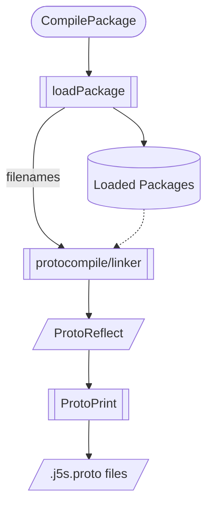
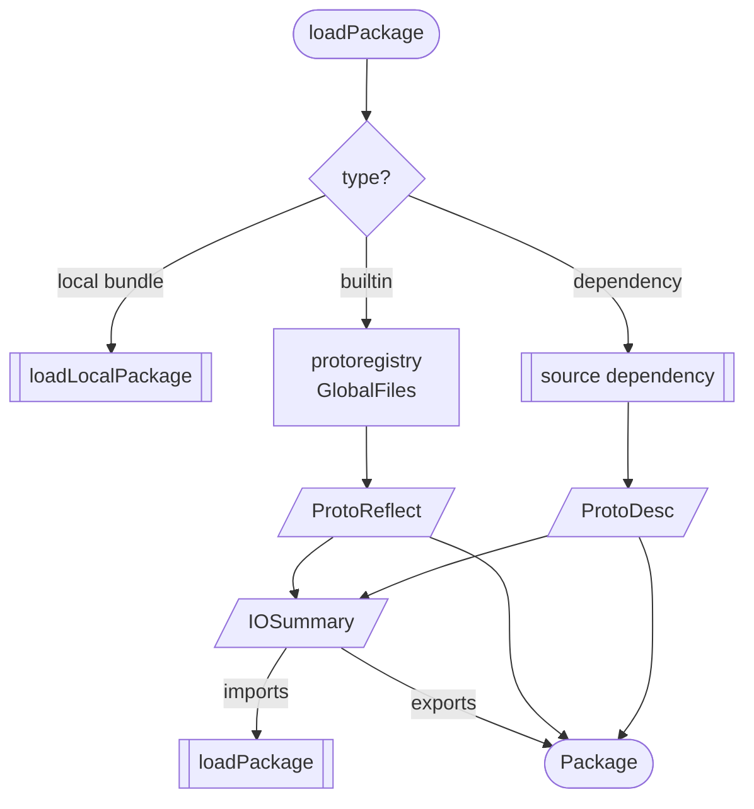
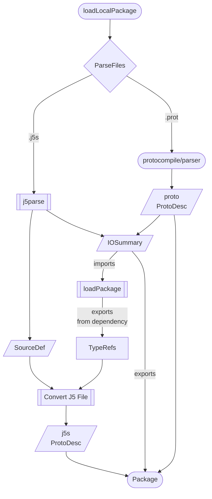

Proto and J5 Parsing
====================

## j5parse - BCL Source Files to SourceDef

The j5parse package defines the schema and wraps the bcl parser (internal/bcl)
to parse bcl / j5s source files into a proto representation of the J5 schema
files, defined at `proto/j5/sourcedef/file.proto` in this repo.

The SourceDef schema contains j5 schema elements (object, oneof, enum), 
extended versions of Services and Topics, and a custom 'Entity' element.

## j5convert and sourcewalk - BCL Proto to Proto Descriptors

J5Convert converts the output of j5Parse into a Proto File Descriptors.

SourceWalk implements the Visitor pattern for SourceDef.

Objects and Oneofs are converted to Messages.

Properties become Fields in each, with custom annotations for j5 extensions,
the same annotations are used when converting raw proto files into
j5 schemas.

Enums are converted to... Enums.

Services are modified but also become Services.

Topics become services with empty replies.

Entities are converted to the full Message and Enum set required (keys, data, event, status)
and a standard query service (Get, List, ListEvents).

## protobuild - Bundles to Proto Reflection

Uses buf's protocompile Parser and Linker to convert proto source files (.proto
files) and the output of j5convert into linked ProtoReflect objects.

Linking requires access to the full import tree for each file, so protobuild
also receives 'dependency bundles', which are further sets of .proto files,
downloaded from the registry server.

# Full Process

'loadPackage' pulls in the source, remote or built-in package and caches it in a
package set.

The Linker requests dependencies at Link time, which are pulled from the cache
and provided as 'parser results', which can be either ProtoDesc or ProtoReflect.

The "IOSummary" object can be derived directly from a Parsed J5s File, a Proto
Descriptor or Proto Reflection object. It lists the file's imports (files or
packages), and the exported types for the file.

The Imports from IOSummary are used to recursively load the package's
dependencies, prior to linking.

The J5 Conversion process requires the TypeRefs from dependencies, which can
be derived from the unlinked source files, and are used to:

- Provide Enum values for constraints
- Check Object and Oneof references match Messages
- Find the specific proto file name for package level imports (Which are the standard in j5s files)

### Compile Package

### Load Package

### Load Local Package

